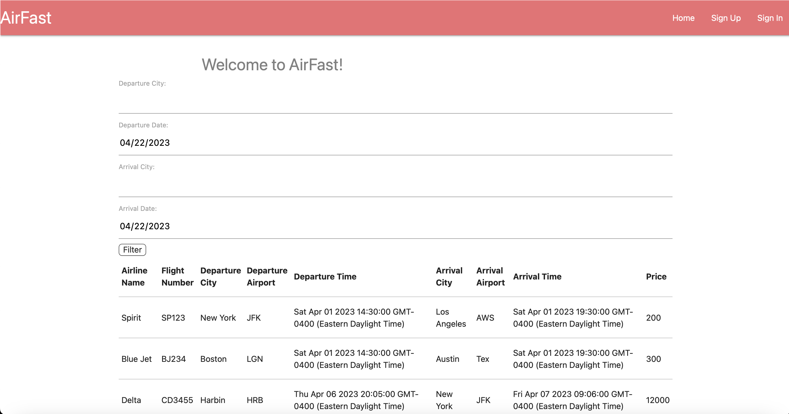
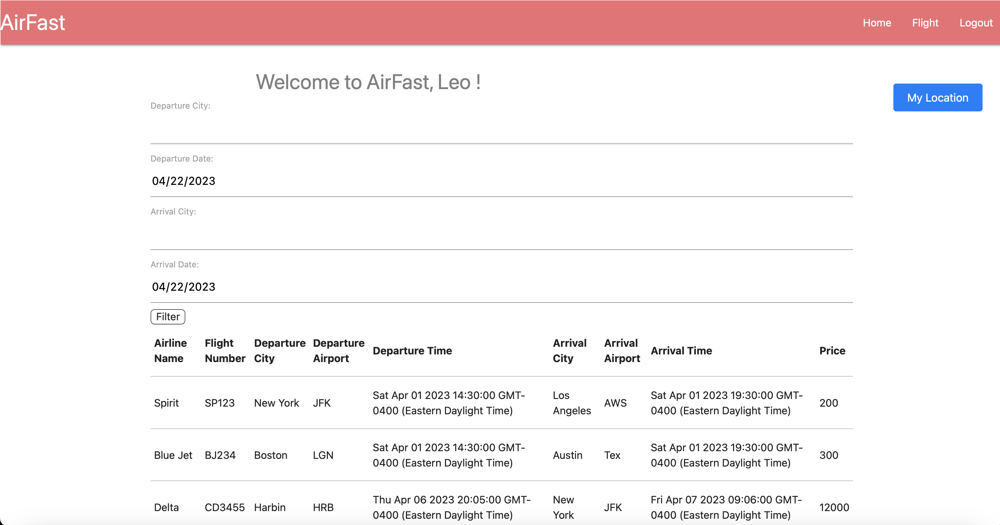
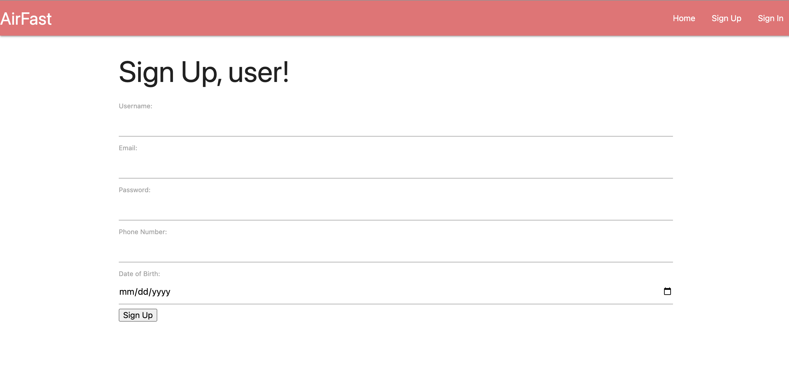
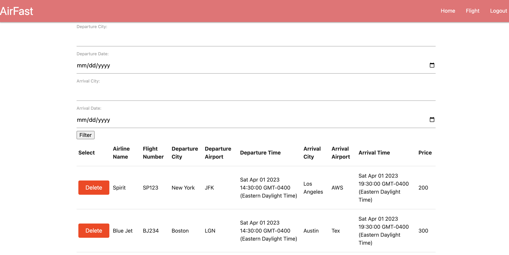
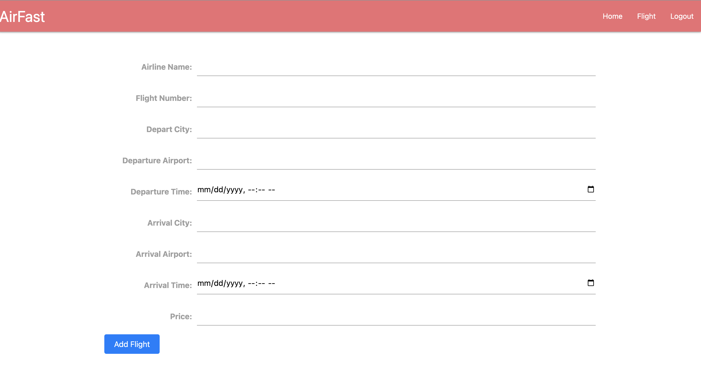
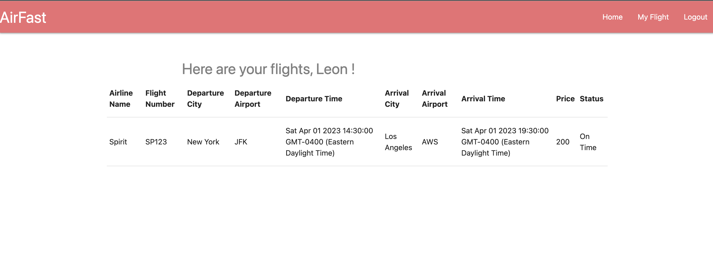
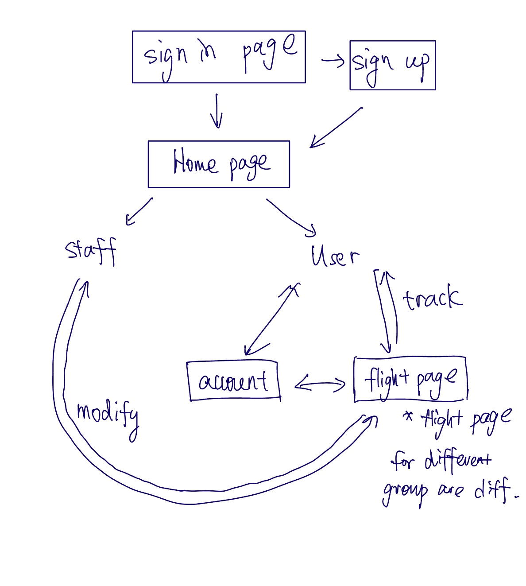

# AirFast 

## Overview

By Leonard Shi bs4297

Travelling by air is one of the most welcome long-distance travel methods across the US. It is always too messy to keep track of different flight in a universal system. We want to make tracking our flight more conveniently.

AirFast is a web app that will allow users to keep track of Airline Checking System. Users can register and login. Once they're logged in, they can create or view their selected flight list. For every list that they have, they can add items to the list or cross off items. Others are staff, where they can register with a unique key and manage flight in the system.


## Data Model

The web application will store Users, Staff, and flight information models. Users will have access to all flights stored in their own data store (there will be some pre-populated already to help foster usability), and will have the ability to add new intended flights, filtered by airline_name, flight_num, departure_airport, departure_time, price, etc. Users will have the ability to make changes to their flight.

Staff will have the access to manage flights, aka adding, deleting flight at their wishes. 

User Schema will include the following info depicted below. Note that the user general info is stored as entered, but their password, which is encrypted and hashed in to the database to preserve safety and user protection.


An Example User:

```javascript
{
  email: "123@123.com",
  name: "Leonard Shi",
  password: "fkshjlfajksdfhljkhsdjf", // hashed string
  phoneNumber: 1232233325,
  date_of_birth: 2004-03-29,
  personalFlight: ['SP123','DS3452']
}
```

An Example Staff:

```javascript
{
  email: "123@123.com",
  name: "Leonard Shi",
  password: "fkshjlfajksdfhljkhsdjf", // hashed string
  phoneNumber: 1232233325,
  date_of_birth: 2004-03-29
}
```

An Example Flight:

```javascript
{
  StaffId: //a reference to a Staff object ID that was responsible for creating this flight
  airlineName: "Spirit Airlines",
  flightNumber: "007",
  departureAirport: "JFK",
  departureTime: "datetime",
  arrivalAirport: "JFK",
  arrivalTime: "datetime",
  price: 367,
}
```


## [Link to Commented First Draft Schema](db.mjs) 


## Wireframes

/welcome - page for Sign in and sign up



/home - page for showing all track-intended flight



/signUp - sign up for an user/staff account



/modFlight - page for staff deleting flights



/addFlight - page for staff adding flights



/myFlight - page for user storing flights



## Site map



## User Stories or Use Cases

1. as non-registered user, I can register a new account with the site
2. as a user/staff, I can log in to the site
3. as a user, I can add flight to my attention list
4. as a user, I can view all of the flights I've listed
5. as a staff, I can create new flight to the list
6. as a staff, I can delete the existing flight in the list, because it is out-of-date
7. as a staff/user, I can check my device's location if signed in

## Research Topics


* (5 points) Integrate user authentication
    * I plan to create general log in and registration with passportJS 
    * As a new user, you can register by filling in the boxes, and immediately after submitting form, if everything you have submitted is found in the database, the page will reload for logging in
* (4 points) New CSS Framework
    * I plan to use materialize.css to enhance my front-end skills
* (4 points) Integrate Google Maps API
    * I plan to learn how to implement the Google Maps API, with updating device's location to appear on the home page


## [Link to Initial Main Project File](app.mjs) 


## Annotations / References Used

* Google Maps Geolocation API Docs -- https://developers.google.com/maps/documentation/javascript/
* PassportJS Tutorial -- https://www.youtube.com/watch?v=Z1ktxiqyiLA 
* CSS Docs -- http://materializecss.com/


